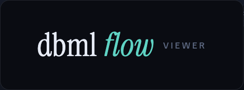

<div align="center">



### [▶ Live demo](https://timvancann.github.io/dbml-flow/)

</div>

A next-gen, **read-only** visualizer for the [DBML](https://dbml.dbdiagram.io/) standard,
built for exploring large, generated data-warehouse schemas (e.g.
[dbterd](https://github.com/datnguye/dbterd) output) with speed and clarity.

The point isn't to draw every table at once — it's **fast, surgical navigation of huge
foreign-key graphs**: "what tables and relationships make up this data mart, and how are
they connected?"

## Features

- **Schema overview** — a model opens as group super-nodes (with table/ref counts), not a
  hairball. Click a group to drill into its tables.
- **Selector grammar** — the canvas only ever renders a selected subgraph, driven by one
  dbt-style selector string (shareable via URL). It's a small, composable language for
  **selecting** tables and groups, **hiding/excluding** the noise, **traversing**
  relationships (directional or undirected, by hop distance), and **finding the route**
  between two tables. Combine operators freely — union, intersect, exclude, expand:

  | Syntax | Meaning |
  |---|---|
  | `d_customer` | one table (full name or last-segment) |
  | `a b` | union (whitespace) |
  | `a,b` | intersection (no spaces) |
  | `!x` / `--exclude x` | exclude |
  | `~a` / `~2a` | undirected neighbors within 1 / 2 hops |
  | `+a` / `a+` | directional: toward-facts / toward-dimensions |
  | `group:sales` / `g:sales_*` | a group / group glob |
  | `*order*` | table-name glob |
  | `path:a>b` | shortest FK path between two tables |

- **Click-to-focus + hop stepper** — click any table to see it plus its in/out neighbors;
  step the hop distance up/down live.
- **Path finding** — "Find path", pick two tables, and the shortest reference path renders.
- **Inspector** — the selected table's columns and foreign keys in collapsible lists;
  click a ref to extend the selection.
- **Fact/dimension coding** — facts amber, dimensions cyan, FK ports and PK badges, with an
  elk crossing-minimized layout.
- **Bring your own schema** — upload a `.dbml` file in-app, or bake one into the Docker
  image (below). The current selector persists in the URL and `localStorage`, so a view is
  just a link you can share.

The bundled demo data is a small synthetic `shop` schema. No real data ships in the repo.

## Quick start

Uses [Bun](https://bun.sh) and (optionally) [`just`](https://github.com/casey/just).

```bash
bun install
just dev          # or: bun run dev   → http://localhost:5173
```

## Tasks (`just`)

```bash
just dev                          # boot the Vite dev server
just build                        # build the Docker image (no baked schema)
just build path/to/schema.dbml    # build and bake a schema that auto-loads on startup
just run                          # build, then run the container on :8080
just run path/to/schema.dbml      # build with that schema baked in, then run
```

## Run with Docker

```bash
just run                 # → http://localhost:8080  (built-in sample)
# or manually:
docker build -t dbml-flow .
docker run -p 8080:80 dbml-flow
```

### Bake a default schema (optional)

To auto-load your own schema on startup, pass it to `just build`/`just run`:

```bash
just run output.grouped.dbml
```

Under the hood this stages the file and builds with a `BAKED_DBML` build arg:

```bash
docker build --build-arg BAKED_DBML=docker/baked/default.dbml -t dbml-flow .
```

The baked file is the **absolute last image layer**, so swapping schemas only rebuilds that
one layer — `bun install` and the Vite build stay cached. With no baked file, the app serves
the synthetic sample (the served `/dbml/default.dbml` simply 404s and the app falls back).

## Tech stack

Bun + Vite + React + TypeScript · [`@xyflow/react`](https://reactflow.dev) + elkjs (canvas
& layout) · Zustand (state) · [`@dbml/core`](https://www.npmjs.com/package/@dbml/core)
(parsing) · Tailwind + shadcn/ui · Vitest + Playwright (tests) · nginx (container).

## Development

```bash
bun run test      # unit tests (Vitest)
bun run build     # type-check (tsc) + production build (Vite)
```

## Credits & inspiration

DBML Flow stands on the shoulders of some great tools — its niche is the gap between
them: **exploring** a generated schema, almost like a data catalog, but from a single
static DBML file with no database connection and no backend.

- **[Azimutt](https://azimutt.app/)** — the big inspiration for *don't draw the whole
  schema; build focused views of large databases*. DBML Flow is the lightweight take:
  DBML in, exploration out — no database connections, no accounts, no server.
- **[dbterd](https://github.com/datnguye/dbterd)** — generates DBML straight from a dbt
  catalog, which is what makes DBML Flow useful for analytics engineers in the first place.
- **[dbdiagram](https://dbdiagram.io/), [dbdocs](https://dbdocs.io/),
  [DrawSQL](https://drawsql.app/), [drawDB](https://drawdb.app/),
  [ChartDB](https://chartdb.io/)** — excellent for *designing and generating* schemas.
  DBML Flow deliberately goes the other way: you generate once, then explore.

## License

[MIT](LICENSE) © Tim van Cann
